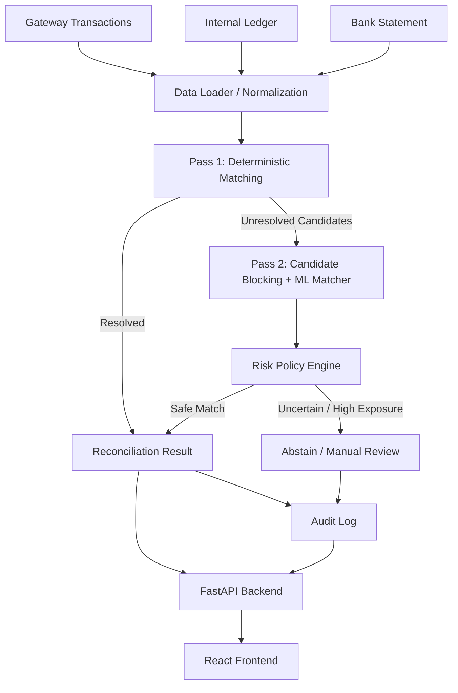

# KuberSetu

[](https://fastapi.tiangolo.com/)
[](https://react.dev/)
[](https://tailwindcss.com/)
[](https://python.org)
[](https://pytest.org)

**Risk-aware 3-way financial reconciliation across payment gateway, internal ledger, and bank settlement data.**

---

## 📌 Executive Summary

Modern payment operations process millions of transactions across fragmented systems: payment gateways (e.g. Razorpay, PayU), internal order ledgers, and bank settlement statements. Reconciling these datasets manually leads to operational bottlenecks caused by string reference mutations, gateway MDR fee deductions, settlement timing delays, and orphaned records.

Naive reconciliation systems rely on rigid exact matching—which drops legitimate transactions due to minor reference or timing variances—or unconstrained fuzzy string matching—which risks false-positive matches that create direct financial losses.

**KuberSetu** resolves this tension using a 3-pass architecture:
1. **Pass 1 (Deterministic Matcher)**: Resolves exact reference and numerical matches instantly.
2. **Pass 2 (Candidate-Blocked ML Matcher)**: Scores residual fuzzy candidates using a Logistic Regression model trained on string similarity, length deltas, amount variance, and date drift.
3. **Pass 3 (Risk Policy Engine)**: Evaluates expected financial loss (`expected_loss = (1 - confidence) * exposure`) against tiered risk tolerance thresholds before allowing auto-resolution.

The core architectural principle of KuberSetu is:
> **"ML proposes a match; the risk policy decides whether that match is safe to automate."**

In benchmark evaluations on a 600-record dataset, KuberSetu achieves **100.00% precision** with zero false matches and **INR 0.00 false-match exposure**, while increasing valid recall from 88.95% to 89.32% and safely controlling automation at 76.86%.

---

## 🎯 The Problem

Financial transaction reconciliation across three independent data sources encounters six primary variance patterns:

- **Exact Match (`EXACT_MATCH`)**: Gateway ID, ledger ID, bank reference, gross amount, and dates align perfectly.
- **Reference Variance (`REFERENCE_VARIANCE`)**: String mutations such as casing shifts (`txn-` vs `TXN-`), truncated UUIDs, or added prefixes (`GW/`).
- **Fee Variance (`FEE_VARIANCE`)**: Merchant Discount Rate (MDR) processing fees deducted by the gateway before net bank settlement credit (e.g. 2% fee).
- **Timing Drift (`TIMING_DRIFT`)**: Settlement delays where bank credits lag gateway transaction initiation by 1 to 3 days.
- **Duplicate Transactions (`DUPLICATE_DETECTED`)**: Multiple gateway entries attempting to map to a single ledger/bank pair.
- **Missing Sources (`MISSING_SOURCES`)**: Orphaned records present in only one or two sources (Gateway-only, Ledger-only, or Bank-only orphans).

Pure deterministic matching fails on reference and timing variances. Unconstrained fuzzy matching risks pairing incorrect transactions, leading to inaccurate financial closing.

---

## ⚡ Why the Architecture is Different

In fintech, a high similarity score does not automatically make a transaction safe to auto-resolve. A 95% ML similarity match on a ₹10,00,000 transaction carries an expected loss of ₹50,000—a risk no financial controller would automate.

KuberSetu decouples probabilistic candidate matching from financial risk authorization:

```text
Naive Reconciliation:
Exact Matching ──> Unresolved Exceptions (High Manual Backlog)
Fuzzy Matching ──> Unconstrained Auto-Resolution (False Positive Payout Risk)

KuberSetu Architecture:
Input Data
   │
   ▼
Pass 1: Deterministic ID Matching ──> Exact Matches
   │
   ▼ (Unmatched Residuals)
Pass 2: Candidate Blocking + ML Scoring (Logistic Regression) ──> Probabilistic Candidates
   │
   ▼
Pass 3: Risk Policy Engine (Expected Loss <= Tiered Risk Tolerance)
   ├──> Safe Matches ──> AUTO_RESOLVED Queue
   └──> High Risk / Uncertain ──> HUMAN_REVIEW / UNRESOLVED_ORPHAN Queue
```

### Risk Policy Triage Logic
1. **Expected Loss Calculation**: `expected_loss = (1 - confidence) * exposure`
2. **Tiered Exposure Scaling**: Risk tolerance scales dynamically based on transaction magnitude. For transactions above ₹50,000, risk tolerance tightens (e.g. ₹250 max loss tolerance vs ₹500 baseline) to limit high-value exposure.
3. **Abstention by Design**: If expected loss exceeds risk tolerance, KuberSetu deliberately abstains and routes the item to the `HUMAN_REVIEW` queue. Consequently, automation rate is controlled (76.86%) to guarantee 100.00% precision.

---

## 📐 System Architecture



---

## 📈 Measured Results & Benchmarks

We distinguish between **Standalone ML Matcher Performance** and **End-to-End Reconciliation Engine Performance**.

### 1. Standalone ML Matcher (Logistic Regression)
The ML matcher extracts 4 features (`amount_difference_pct`, `date_difference_days`, `reference_string_similarity`, `reference_length_difference`) from Pass 2 candidate pairs:

- **Total Candidate Pairs Extracted**: 357 pairs
- **Train / Test Split**: 285 train pairs (80%), 72 held-out test pairs (20%)
- **Test Set Precision**: **70.59%** (12 True Positives, 5 False Positives out of 17 predicted positive pairs)
- **Test Set Recall**: **100.00%** (12/12 true positive fuzzy pairs recovered)
- **Brier Score**: **0.0390** (Mean Squared Error between predicted probability and match outcome)
- **Confusion Matrix**:
  ```text
  [[TN: 55, FP: 5],
   [FN:  0, TP: 12]]
  ```
- **Production Decision Threshold**: `>= 0.50` probability cutoff.
- **Model Calibration Note**: The model outputs raw Logistic Regression `predict_proba()` estimates evaluated on a modest held-out dataset (72 candidates). It is not formally calibrated via Platt scaling or isotonic regression.

### 2. End-to-End System Benchmark Comparison
Programmatically generated by `benchmark.py` running Baseline Exact Matching vs. KuberSetu Full Pipeline against `ground_truth.json` (persisted in `BENCHMARK.md`):

| Metric | Baseline V1 (Exact Match) | KuberSetu V2 (Full Pipeline) |
| :--- | :---: | :---: |
| **Precision** | 100.00% | **100.00%** |
| **Recall** | 88.95% | **89.32%** |
| **False-Match Count** | 0 | **0** |
| **False-Match Exposure** | ₹0.00 | **₹0.00** |
| **Automation Rate** | 76.55% | **76.86%** |
| **Orphan Count** | 148 | **48** |
| **Ambiguous-Unresolved Count** | 0 | **7** |

*Note: The end-to-end precision is 100.00% because Pass 3 (Risk Policy Engine) filters out candidate matches where expected financial loss exceeds risk tolerance. Residual recall loss is concentrated in near-threshold fuzzy candidates (`TIMING_DRIFT`, `FEE_VARIANCE`, and `REFERENCE_VARIANCE` cases scoring just under the 0.50 ML confidence threshold) rather than random noise, and these are now surfaced as `AMBIGUOUS_UNRESOLVED` with their best candidate shown for human review instead of being silently misclassified as orphans.*

---

## 🔄 Reproducibility & Model Lifecycle

### 1. Candidate Blocking Optimization
To avoid an $O(N^3)$ exhaustive comparison across unmatched records, Pass 2 bucketizes records by merchant account, rounded 3-day date windows, and ₹100-rounded amount buckets.
- **Unblocked Comparisons**: 666,900 candidate evaluations
- **Blocked Comparisons**: 119 candidate evaluations
- **Complexity Reduction**: **99.98%**

### 2. Data-Fingerprint Safeguard
To prevent stale model inference when underlying datasets are regenerated, `ml_matcher.py` implements a data-consistency safeguard:
1. `compute_data_fingerprint()` calculates a deterministic SHA-256 hash across `bank.csv`, `gateway.csv`, `ground_truth.json`, and `ledger.csv`.
2. The hash is saved to `models/matcher_model_meta.json`.
3. `get_matcher_model()` verifies the stored fingerprint against current data files. If data files change or metadata is missing, retraining triggers automatically.

---

## 🚫 What This System Doesn't Handle

To maintain complete transparency regarding technical scope:

1. **Many-to-One / One-to-Many Batch Settlements**: Assumes a 1:1:1 mapping across gateway, ledger, and bank entries. Does not disaggregate bulk bank payout credits covering multiple individual transactions.
2. **Multi-Currency & FX Rate Spreads**: Expects single-currency (INR) records. Cross-border payments with foreign exchange spreads are not supported.
3. **Dynamic / Tiered Merchant MDR Models**: Fee variance detection uses bounded percentage windows (<= 5% MDR). Volume-based slab changes mid-month require custom fee lookup tables.
4. **Real-Time Streaming Event Ingestion**: Operates as a batch API pipeline; does not connect directly to real-time Kafka or RabbitMQ event streams.
5. **Persistent Database Storage**: Saves audit trails to timestamped JSON files in `/logs`. Production deployment requires PostgreSQL or AWS S3 integration.
6. **Formally Calibrated ML Probabilities**: Uses raw Logistic Regression `predict_proba()` estimates—validated by precision, recall, and Brier score (0.0390) on a modest test set—rather than formally calibrated probabilities via Platt scaling or isotonic regression.

---

## 🛠️ Setup & Run Instructions

### Prerequisites
- Python 3.10+
- Node.js 18+ & npm
- Docker & Docker Compose (optional)

### Local Setup

#### 1. Backend (FastAPI)
```bash
# Clone the repository
git clone https://github.com/maitray-agrawal/KuberSetu.git
cd KuberSetu

# Create and activate virtual environment
python -m venv venv
# On Windows:
.\venv\Scripts\activate
# On Linux/macOS:
source venv/bin/activate

# Install dependencies
pip install -r requirements.txt

# Run pytest test suite (11 tests)
python -m pytest test_ml_matcher.py test_main.py -v

# Run programmatic benchmark
python benchmark.py

# Start FastAPI backend server
python -m uvicorn main:app --host 0.0.0.0 --port 8000
```
Backend API will be available at `http://localhost:8000` (Interactive docs at `http://localhost:8000/docs`).

#### 2. Frontend (React + Vite + Tailwind)
```bash
cd frontend

# Install dependencies
npm install

# Verify production build
npm run build

# Start Vite dev server
npm run dev
```
Frontend UI will be available at `http://localhost:5173`.

---

### Running with Docker Compose

```bash
# Build and run containerized services
docker compose up --build
```
- **Frontend SPA (Nginx Proxy)**: `http://localhost:3000`
- **Backend REST API**: `http://localhost:8000`

---

## ⚙️ Environment Variables

| Variable | Description | Default |
| :--- | :--- | :--- |
| `RISK_TOLERANCE_INR` | Baseline maximum acceptable expected loss (₹) for auto-resolution | `500.00` |
| `CORS_ORIGINS` | Allowed CORS origins for FastAPI middleware | `*` |
| `DATA_DIR` | Path to dataset directory containing CSV files | `data` |
| `VITE_API_BASE_URL` | Deployed backend URL for frontend API requests | `http://localhost:8000` |
